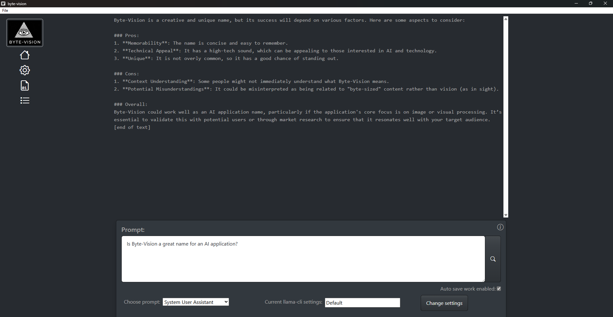
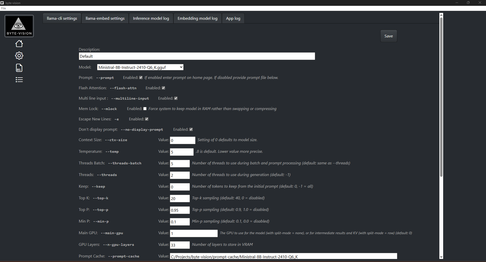
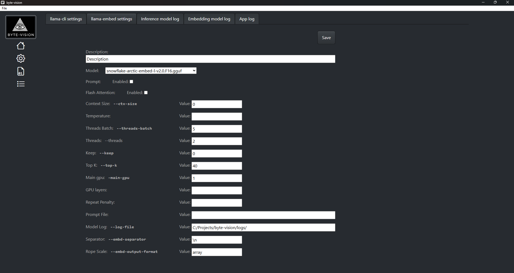
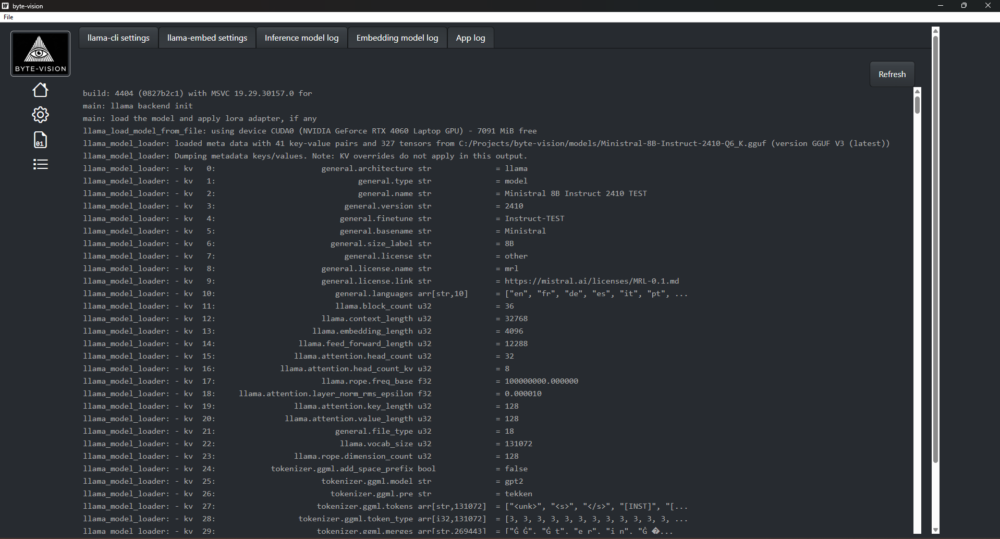
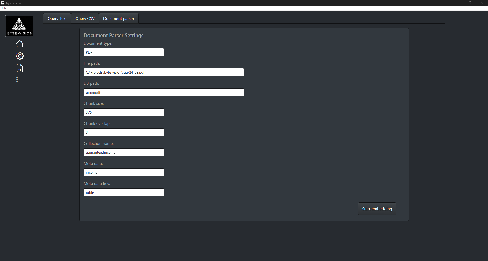
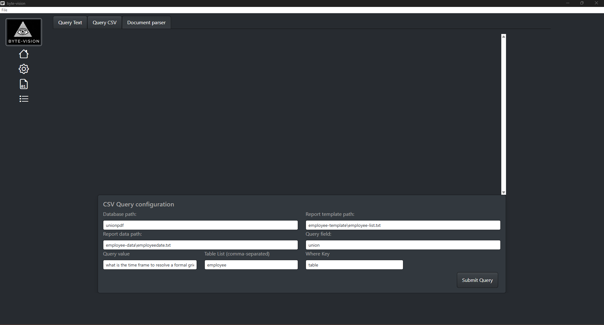
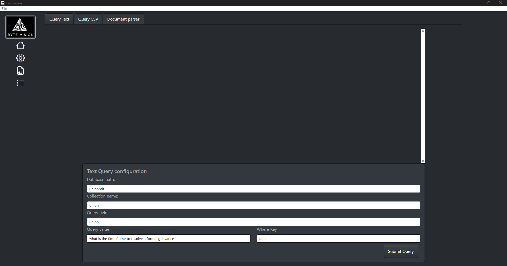
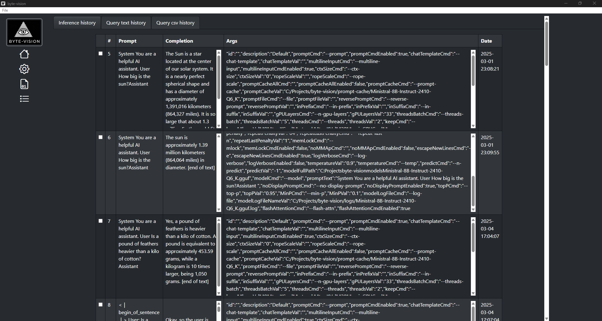
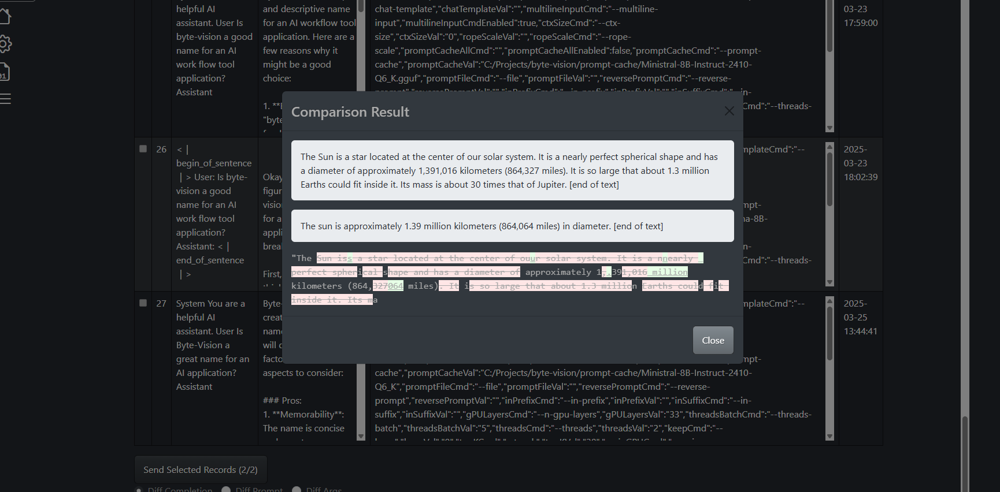

     

# Byte-Vision <i>beta</i>

#### What is Byte-Vision? Byte-Vision is a llama.cpp testing/workflow GUI application. It is written in Go and uses the Wails framework. The tool was developed to facilitate the tracking of test runs and the easy saving of llama.cpp settings. Existing Python packages did not meet these requirements. The project aims to help other developers understand how llama.cpp functions by providing a straightforward flat project. Llama.cpp offers numerous parameters, and this Go application enables quick model switches, setting changes, and version swaps. Completions and settings are saved in a database, allowing for result comparisons and workflow-specific testing tracking.

# Table of Contents

1. [Quick tour of GUI](#Tour)
2. [Built with](#Built-with)
3. [Installing and running application in dev.](#Installing-and-running-application-in-dev)
4. [Roadmap](#Roadmap)
5. [Contributing](#Contributing)
6. [License](#License)
7. [Contact](#Contact)

## Tour of interface features.

### Main screen with menu and inference screen.  

### Settings screen, settings for llama-cli, llama-embedding and various logs.
#### Llama-cli parameters

#### Lama-embedding parameters

#### Llama-cli inference model log.

### Embedding screen, settings for CSV embedding, text embedding and document parser.
#### Doc parser setup.

#### CSV embedding query.

#### Text embedding query.

### Inference history and compare screen.
#### Inference history viewer.

#### Completion diff example.

(<a href="#top">back to top</a>)

## Built with
* [Wails](https://github.com/wailsapp/wails)
* [Llamacpp](https://github.com/ggml-org/llama.cpp)
* [Chromen-Go](github.com/philippgille/chromem-go)
* [React](https://react.dev/)
* [Go SQL Lite](github.com/mattn/go-sqlite3)
* [Bootstrap 5](https://getbootstrap.com)
* [Go-Diff](github.com/sergi/go-diff)

(<a href="#top">back to top</a>)

## Installing and running application in dev
To-do

## Roadmap
The feature list is the following
Finish saving llama-cli settings.
Finish saving llama-embedding settings.
Finish how-to docs and examples.

See the [open issues](https://github.com/kbrisso/file-base/issues) for a full list of proposed features (and known issues).

(<a href="#top">back to top</a>)

## Contributing
Contributions are what make the open source community such an amazing place to learn, inspire, and create. Any contributions you make are **greatly appreciated**.

If you have a suggestion that would make this better, please fork the repo and create a pull request. You can also simply open an issue with the tag "enhancement".
Don't forget to give the project a star! Thanks again!

1. Fork the Project
2. Create your Feature Branch (`git checkout -b feature/AmazingFeature`)
3. Commit your Changes (`git commit -m 'Add some AmazingFeature'`)
4. Push to the Branch (`git push origin feature/AmazingFeature`)
5. Open a Pull Request

(<a href="#top">back to top</a>)

## License
GNU General Public License v3.0

(<a href="#top">back to top</a>)

## Contact

Kevin Brisson - [LinkedIn](https://www.linkedin.com/in/kevin-brisson-918445185/) - kbrisso@gmail.com
Project Link: [https://github.com/kbrisso/byte-vision](https://github.com/kbrisso/file-base)

(<a href="#top">back to top</a>)

