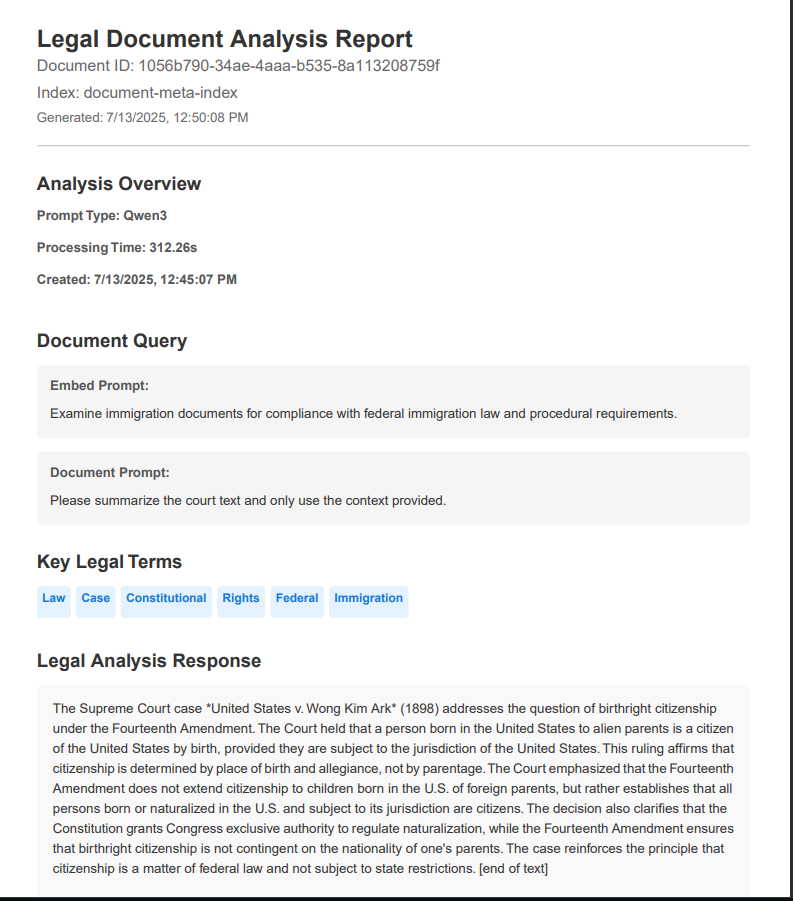

<p align="center" width="100%">
     
</p>

# Byte-Vision: AI-Powered Document Intelligence Platform

> **Status**: Beta - Under active development

**Byte-Vision** is a privacy-first document intelligence platform that transforms static documents into an interactive, searchable knowledge base. Built on Elasticsearch with RAG (Retrieval-Augmented Generation) capabilities, it offers document parsing, OCR processing, and conversational AI interfaces—all running locally to ensure complete data privacy.

## ✨ Key Features

- 📄 **Universal Document Processing** - Parse PDFs, text files, and CSVs with built-in OCR for image-based content
- 🔍 **AI-Enhanced Search** - Semantic search powered by Elasticsearch and vector embeddings
- 💬 **Conversational AI** - Document-specific Q&A and free-form chat with local LLM integration
- 📊 **Research Management** - Automatically save and organize insights from document analysis
- 🔒 **Privacy-First** - Runs entirely locally with no external data transmission
- 🖥️ **Intuitive Interface** - Full-featured UI that simplifies complex document operations

## 🚀 Quick Start

### Prerequisites
- [Go 1.23+](https://golang.org/dl/)
- [Node.js 18+](https://nodejs.org/)
- [Elasticsearch 8.x](https://www.elastic.co/downloads/elasticsearch)
- [Wails v2](https://wails.io/docs/gettingstarted/installation)
- [tesseract-ocr.github.io](https://tesseract-ocr.github.io/)
- [XpdfReader](https://www.xpdfreader.com/index.html)
- [Llama.cpp](https://github.com/ggml-org/llama.cpp)

### Installation
For detailed setup instructions, see [Installation Guide](#installation).

## 📋 Table of Contents
- [Interface Tour](#-interface-tour)
- [Installation](#-installation)
    - [Prerequisites](#prerequisites)
    - [Development Setup](#development-setup)
    - [Production Build](#production-build)
- [Configuration](#-configuration)
- [Usage](#-usage)
- [Troubleshooting](#-troubleshooting)
- [Development](#-development)
    - [Built With](#built-with)
    - [Project Structure](#project-structure)
    - [Logs and Debugging](#logs-and-debugging)
- [Contributing](#-contributing)
- [Roadmap](#-roadmap)
- [License](#-license)
- [Contact](#-contact)

## 🖼️ Interface Tour

### Document Search Screen
The main "Document Search" screen allows you to locate and analyze documents after they have been parsed and indexed in Elasticsearch.


### Document Viewer
Click the "View" button to display the original parsed document.


### Question and Answer Interface

#### Default View - History Tab
View previously saved question-answer history items for the selected document.


#### Question Entry Form
Enter your questions about the document using this interface.


#### Processing Stage
The system processes your question and searches through the document.


#### Results Display
View the AI-generated answers based on your document content.


#### Export to PDF
Export your question-answer sessions to PDF format for documentation.



### Document Processing Features

#### Document Parsing and Chunking
Parse PDF, text, and CSV files for processing and analysis.


#### Parser Results
View the results of document parsing and chunking operations.


### OCR Processing

#### Image Scan Setup
Configure OCR settings for processing scanned documents.


#### OCR Results
Review extracted text from image-based documents.


### AI Inference Screen

#### Main Interface
Primary inference screen for general AI conversations.


#### Chat History
View previous conversations and responses.


#### Export Chat History
Export inference conversations to PDF format.


## 📦 Installation

### Prerequisites

| Component | Version | Purpose |
|-----------|---------|---------|
| [Go](https://golang.org/dl/) | 1.23+ | Backend services |
| [Node.js](https://nodejs.org/) | 18+ | Frontend build system |
| [Elasticsearch](https://www.elastic.co/downloads/elasticsearch) | 8.x | Document indexing and search |
| [Wails](https://wails.io/docs/gettingstarted/installation) | v2 | Desktop application framework |

#### System Requirements
- **OS**: Windows 10+, macOS 10.13+, or Linux
- **RAM**: 8GB minimum (16GB recommended)
- **Storage**: 5GB free space
- **CPU**: Multi-core processor recommended

#### Optional Dependencies
- **CUDA**: Enables GPU acceleration for AI models
- **Docker**: Containerize Elasticsearch for easier deployment

### Development Setup

#### 1. Clone and Install Dependencies
```bash
git clone https://github.com/kbrisso/byte-vision.git
cd byte-vision

# Install Go dependencies
go mod download && go mod tidy

# Install Wails CLI
go install github.com/wailsapp/wails/v2/cmd/wails@latest

# Install frontend dependencies
cd frontend && npm install && cd ..
```

#### 2. Set Up Elasticsearch
**Option A: Docker (Recommended)**

```bash docker run -d --name elasticsearch
-p 9200:9200 -p 9300:9300
-e "discovery.type=single-node"
-e "xpack.security.enabled=false"
docker.elastic.co/elastic/elastic:8.11.0
```

**Option B: Local Installation**
1. Download from [Elasticsearch Downloads](https://www.elastic.co/downloads/elasticsearch)
2. Extract and run:

```bash
# Windows
bin\elasticsearch.bat       
# macOS/Linux
bin/elastic   
```
#### 3. Install LlamaCpp

**Option A: Download Pre-built Binaries (Recommended)**
1. Visit [LlamaCpp releases](https://github.com/ggerganov/llama.cpp/releases)
2. Download for your platform:
    - **Windows**: `llama-*-bin-win-x64.zip` (CPU) or `llama-*-bin-win-cuda-cu*.zip` (GPU)
    - **Linux**: `llama-*-bin-ubuntu-x64.tar.gz`
    - **macOS**: `brew install llama.cpp`
3. Extract to `llamacpp/` directory

**Option B: Build from Source**
```
git clone https://github.com/ggerganov/llama.cpp.git temp-llama
cd temp-llama && mkdir build && cd build
cmake .. -DLLAMA_CUDA=ON  # Add for GPU support
cmake --build . --config Release
cp bin/llama-cli ../llamacpp/
cd ../.. && rm -rf temp-llama
```

#### 4. Download AI Models
```
mkdir -p models
```
# Download example models
```
curl -L -o models/llama-2-7b-chat.Q4_K_M.gguf \
https://huggingface.co/TheBloke/Llama-2-7B-Chat-GGUF/resolve/main/llama-2-7b-chat.Q4_K_M.gguf

curl -L -o models/all-MiniLM-L6-v2.gguf \
https://huggingface.co/sentence-transformers/all-MiniLM-L6-v2-gguf/resolve/main/all-MiniLM-L6-v2.gguf
```

#### 5. Install xpdf-tools
Download and install xpdf-tools for PDF processing:

**Option A: Download Pre-built Binaries (Recommended)**
1. Visit [Xpdf downloads](https://www.xpdfreader.com/download.html)
2. Download the appropriate version for your platform:
    - **Windows**: `xpdf-tools-win-*-setup.exe`
    - **Linux**: `xpdf-tools-linux-*-static.tar.gz`
    - **macOS**: `xpdf-tools-mac-*-setup.dmg`
3. Extract or install to the `xpdf-tools/` directory in your project root

**Option B: Package Manager Installation**

```bash
# macOS
brew install xpdf
# Ubuntu/Debian
sudo apt-get install xpdf-utils
# Windows (using Chocolatey)
choco install xpdf-utils
```
#### 6. Install Tesseract-OCR
Install Tesseract-OCR for optical character recognition:

**Windows:**
1. Download from [Tesseract releases](https://github.com/UB-Mannheim/tesseract/wiki)
2. Install the executable
3. Add Tesseract to your system PATH:
    - Add `C:\Program Files\Tesseract-OCR` to your PATH environment variable
    - Or add custom path in `byte-vision-cfg.env`: `TESSERACT_PATH=C:\path\to\tesseract.exe`

**macOS:**
```bash 
brew install tesseract
```
**Linux (Ubuntu/Debian):**
```bash 
sudo apt-get install tesseract-ocr
```
**Verify Installation:**
```bash
tesseract --version
```

#### 7. Configure Environment
Create `byte-vision-cfg.env`:
# Elasticsearch Configuration
ELASTICSEARCH_URL=http://localhost:9200
ELASTICSEARCH_USERNAME=elastic
ELASTICSEARCH_PASSWORD=your_password

# LlamaCpp Configuration
LLAMA_CLI_PATH=./llamacpp/llama-cli
LLAMA_EMBEDDING_PATH=./llamacpp/llama-embedding

# Model Configuration
MODEL_PATH=./models
DEFAULT_INFERENCE_MODEL=llama-2-7b-chat.Q4_K_M.gguf
DEFAULT_EMBEDDING_MODEL=all-MiniLM-L6-v2.gguf

# Application Settings
MAX_CHUNK_SIZE=1000
CHUNK_OVERLAP=200
LOG_LEVEL=INFO

#### 8. Run the Application
```bash 
wails dev
``` 
The application will launch with hot reload enabled.

### Production Build
```bash 
wails build
```
The built application will be in the build/ directory

## ⚙️ Configuration
The application uses environment variables defined in `byte-vision-cfg.env`:

| Variable | Description | Default |
|----------|-------------|---------|
| `ELASTICSEARCH_URL` | Elasticsearch server URL | `http://localhost:9200` |
| `ELASTICSEARCH_USERNAME` | Elasticsearch username | `elastic` |
| `ELASTICSEARCH_PASSWORD` | Elasticsearch password | - |
| `LLAMA_CLI_PATH` | Path to llama-cli executable | `./llamacpp/llama-cli` |
| `LLAMA_EMBEDDING_PATH` | Path to llama-embedding executable | `./llamacpp/llama-embedding` |
| `MODEL_PATH` | Directory containing AI models | `./models` |
| `DEFAULT_INFERENCE_MODEL` | Default model for inference | - |
| `DEFAULT_EMBEDDING_MODEL` | Default model for embeddings | - |
| `MAX_CHUNK_SIZE` | Maximum text chunk size | `1000` |
| `CHUNK_OVERLAP` | Overlap between chunks | `200` |
| `LOG_LEVEL` | Application log level | `INFO` |

## 📝 Usage

### First-Time Setup
1. **Start Elasticsearch**: Ensure Elasticsearch is running
2. **Launch Byte-Vision**: Run the application
3. **Configure Models**: Go to Settings → LlamaCpp Settings and set paths
4. **Test Connection**: Verify Elasticsearch connection in Settings

### Document Management
1. **Upload Documents**: Use the document parser to upload and process files
2. **Configure Chunking**: Adjust text chunking settings for optimal search
3. **Index Documents**: Process documents for embedding and search

### Document-Specific Q&A
- Select a document from the search results
- Click "Ask Questions" to open the Q&A interface
- Enter your questions and receive AI-generated answers
- View answer sources and confidence scores
- Export Q&A sessions to PDF


### AI Interactions
1. **Ask Questions**: Use the document question modal to query your documents
2. **Export Results**: Export chat history to PDF for documentation
3. **Compare Responses**: Use the comparison feature to evaluate different model outputs

### Free-Form Chat
- Access the AI Inference screen for general conversations
- Chat with your local LLM models
- Export conversation history
- Compare different model responses

## 🔧 Troubleshooting

### Common Issues

<details>
<summary><strong>❌ Elasticsearch Connection Failed</strong></summary>

**Symptoms**: Cannot connect to Elasticsearch service

**Solutions**:
1. Verify Elasticsearch is running:
   ```bash
   curl http://localhost:9200
   ```
2. Check if port 9200 is available:
   ```bash
   netstat -an | grep 9200
   ```
3. Verify configuration in `byte-vision-cfg.env`
4. Check firewall settings
5. For Docker: Ensure container is running
   ```bash
   docker ps | grep elastic
   ```
</details>

<details>
<summary><strong>❌ LlamaCpp Model Loading Error</strong></summary>

**Symptoms**: Model fails to load or produces errors

**Solutions**:
1. Verify model file exists in `models/` directory
2. Check model format (must be `.gguf`)
3. Ensure sufficient RAM for model size
4. Verify `LLAMA_CLI_PATH` in configuration
5. Test LlamaCpp directly:
   ```bash
   ./llamacpp/llama-cli --model ./models/your-model.gguf --prompt "Hello"
   ```
</details>

<details>
<summary><strong>❌ Frontend Build Errors</strong></summary>

**Symptoms**: npm install or build failures

**Solutions**:
1. Clear npm cache:
   ```bash
   cd frontend
   rm -rf node_modules package-lock.json
   npm cache clean --force
   npm install
   ```
2. Check Node.js version: `node --version`
3. Update npm: `npm install -g npm@latest`
</details>

<details>
<summary><strong>❌ Port Already in Use</strong></summary>

**Symptoms**: Application fails to start due to port conflicts

**Solutions**:
1. Find process using port:
   ```bash
   # Windows
   netstat -ano | findstr :3000
   
   # macOS/Linux
   lsof -ti:3000
   ```
2. Kill process:
   ```bash
   # Windows
   taskkill /PID <PID> /F
   
   # macOS/Linux
   kill -9 <PID>
   ```
</details>

### Performance Tips

- **GPU Acceleration**: Install CUDA/ROCm for faster model inference
- **Model Selection**: Use smaller quantized models for better performance
- **Memory Management**: Adjust Elasticsearch heap size for large document collections
- **Chunking Optimization**: Tune `MAX_CHUNK_SIZE` and `CHUNK_OVERLAP` for your use case

### Debug Mode

Enable debug logging:
```bash 
wails dev -debug
```
Check logs in `./logs/` directory for detailed error information.

## 🛠️ Development

### Built With

#### Core Technologies
- **[Wails](https://wails.io)** - Desktop application framework
- **[Go](https://golang.org)** - Backend services and APIs
- **[React](https://react.dev)** - Frontend user interface
- **[Elasticsearch](https://www.elastic.co/elasticsearch/)** - Document indexing and search
- **[Llama.cpp](https://github.com/ggml-ai/llama.cpp)** - Local AI model inference

#### Frontend Stack
- **[React Bootstrap](https://react-bootstrap.netlify.app/)** - UI components
- **[Bootstrap 5](https://getbootstrap.com)** - CSS framework
- **[React PDF](https://github.com/diegomura/react-pdf)** - PDF generation and viewing
- **[Vite](https://vitejs.dev)** - Build tooling

#### Backend Libraries
- **[go-ocr](https://github.com/tiagomelo/go-ocr)** - OCR processing
- **[chunker](https://github.com/jonathanhecl/chunker)** - Text chunking

### Project Structure
```
byte-vision/ 
├── 📁 build/ # Built application files 
├── 📁 document/ # Document storage 
├── 📁 frontend/ # React frontend source 
│ ├── 📁 src/ 
│ └── 📁 public/ 
├── 📁 llamacpp/ # LlamaCpp binaries 
├── 📁 logs/ # Application logs 
├── 📁 models/ # AI model files (.gguf) 
├── 📁 prompt-cache/ # Cached prompts 
├── 📁 prompt-temp/ # Prompt templates 
├── 📁 xpdf-tools/ # PDF processing tools 
├── 📄 byte-vision-cfg.env # Configuration file 
├── 📄 wails.json # Wails configuration 
└── 📄 go.mod # Go dependencies
```

### Logs and Debugging

- **Application logs**: `./logs/`
- **Elasticsearch logs**: Check Elasticsearch installation directory
- **Debug mode**: `wails dev -debug`
- **Frontend logs**: Browser developer console
- **Backend logs**: Terminal output during development

## 🤝 Contributing

Contributions are what make the open source community such an amazing place to learn, inspire, and create. Any contributions you make are **greatly appreciated**.

If you have a suggestion that would make this better, please fork the repo and create a pull request. You can also open an issue with the tag "enhancement." Remember to give the project a star! Thanks again!

### How to Contribute

1. Fork the Project
2. Create your Feature Branch (`git checkout -b feature/AmazingFeature`)
3. Commit your Changes (`git commit -m 'Add some AmazingFeature'`)
4. Push to the Branch (`git push origin feature/AmazingFeature`)
5. Open a Pull Request

### Development Guidelines

- Follow Go formatting standards (`go fmt`)
- Write tests for new features
- Update documentation for API changes
- Use semantic commit messages
- Ensure all tests pass before submitting

## 📈 Roadmap

### In Progress
- [ ] Settings persistence for llama-cli configuration
- [ ] Settings persistence for llama-embedding configuration
- [ ] Enhanced documentation and examples

### Planned Features
- [ ] Additional document format support (DOCX, PPT, etc.)
- [ ] Advanced search filters and operators
- [ ] Batch document processing capabilities
- [ ] RESTful API for external integrations
- [ ] Docker deployment configuration
- [ ] User authentication and access control
- [ ] Cloud storage integration (S3, Google Drive, etc.)
- [ ] Multi-language support
- [ ] Advanced analytics and reporting

### Long-term Vision
- [ ] Distributed processing for large document collections
- [ ] Plugin architecture for custom processors
- [ ] Integration with external AI services
- [ ] Mobile application companion

See [open issues](https://github.com/kbrisso/byte-vision/issues) for detailed feature requests and bug reports.

## 📄 License

This project is licensed under the terms of the MIT license.

## 📧 Contact

Kevin Brisson - [LinkedIn](https://www.linkedin.com/in/kevin-brisson-918445185/) - kbrisso@gmail.com

Project Link: [https://github.com/kbrisso/byte-vision](https://github.com/kbrisso/byte-vision)

---

<p align="center">
  <strong>⭐ Star this project if you find it helpful!</strong>
</p>
